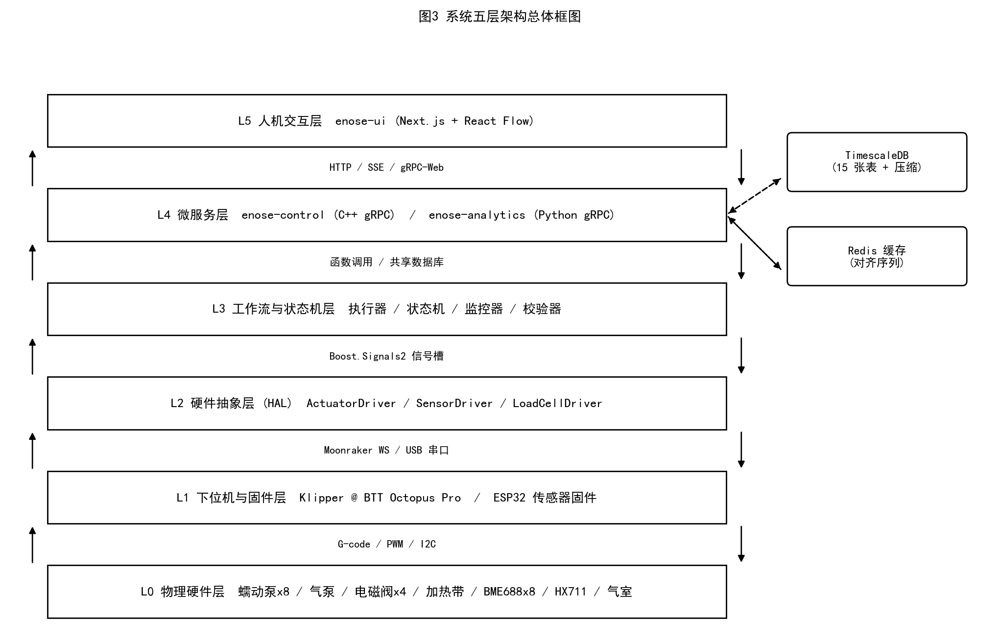
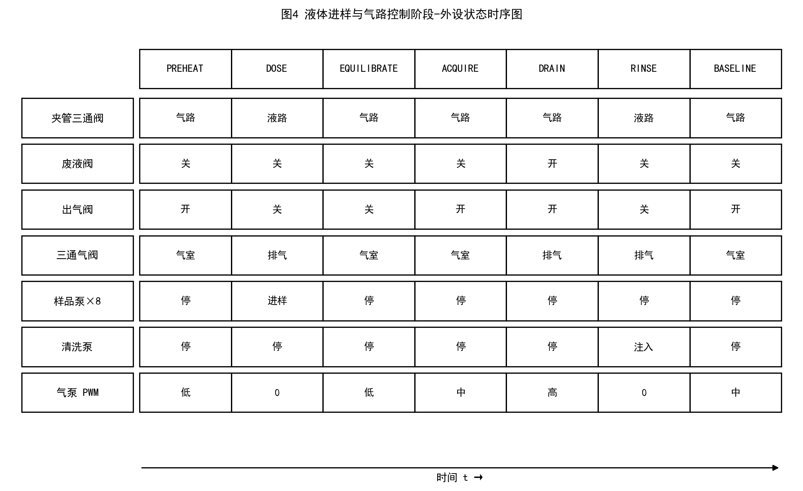
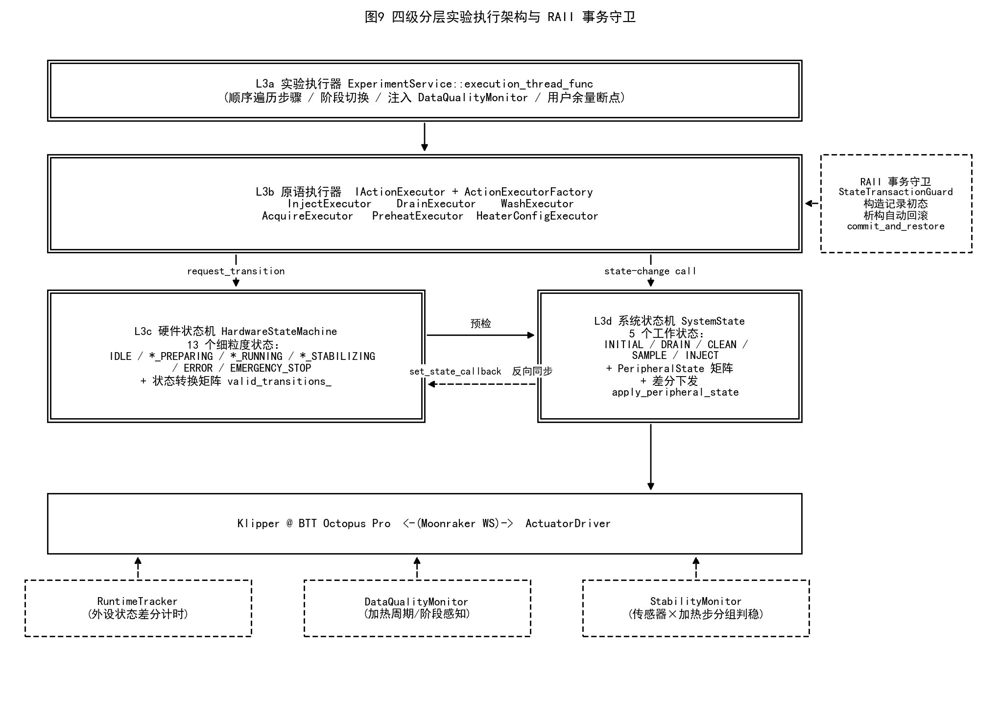
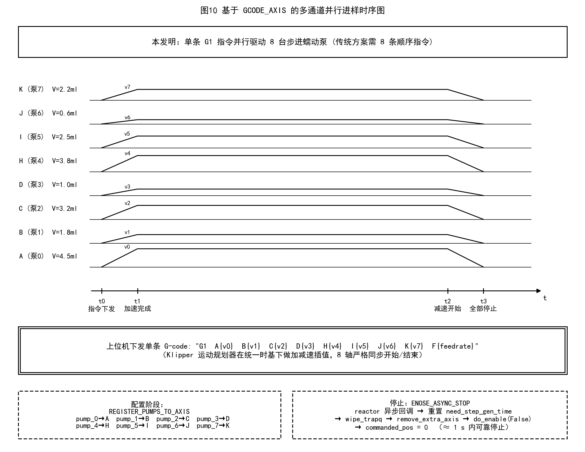
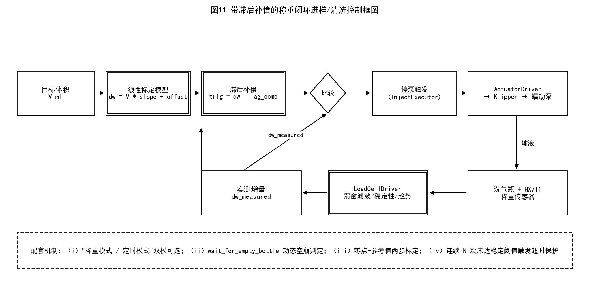
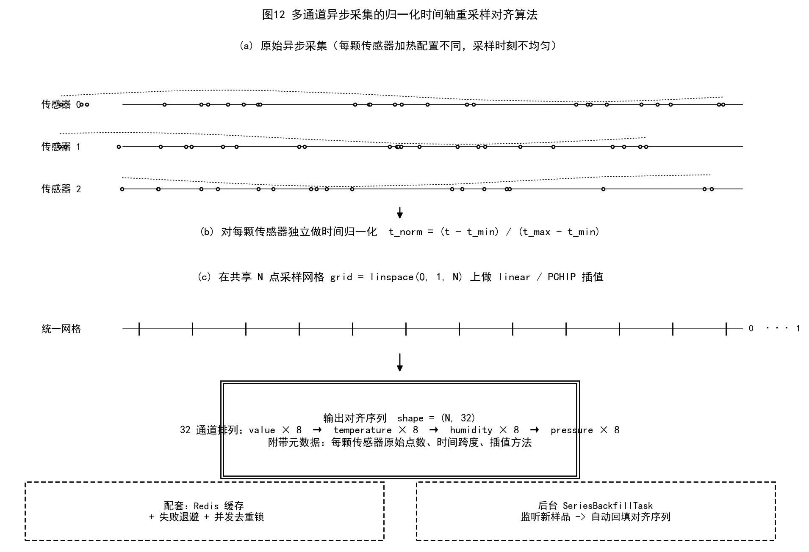
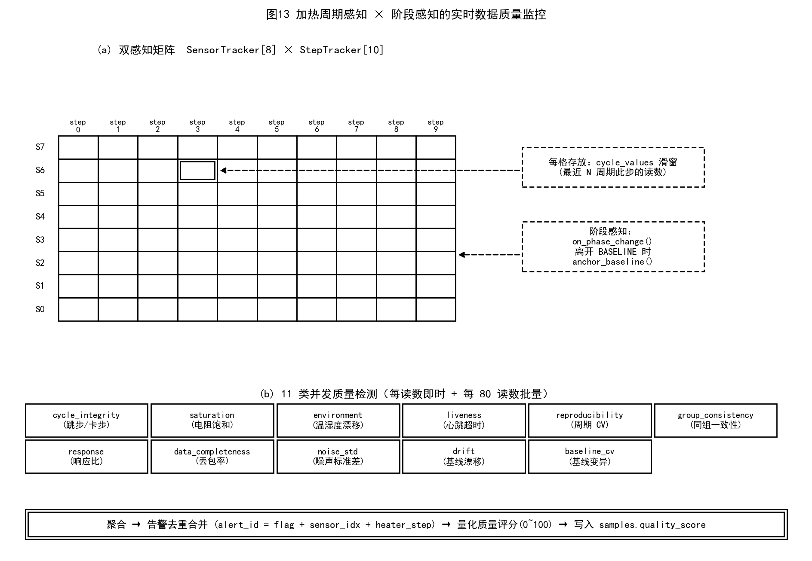
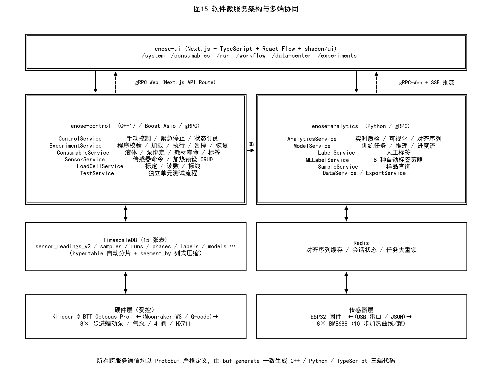
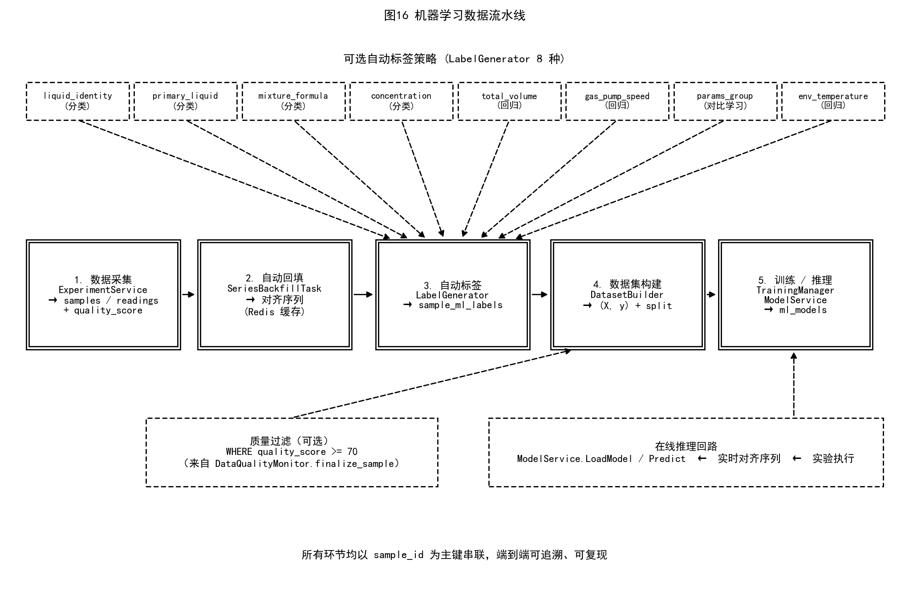

# 技术交底书

## 技术名称

一种自动化液体气味检测装置及其多层状态机控制方法

---

## 发明目的

本发明旨在解决现有电子鼻系统在液体样品自动化处理与方法学层面的不足，提供一种集"多通道精确进样—顶空气体萃取—多通道传感器阵列采集—在线数据质量监控—自动清洗与基线恢复—自动化机器学习数据集构建"于一体的装置及配套控制方法。本发明在硬件结构层面解决了多通道按比例同步进样、闭环称重反馈和多模式气路切换问题；在控制方法层面解决了多通道步进电机单指令并行驱动、异步采集多通道时间对齐、加热周期感知的实时数据质量监控、声明式实验程序的编译期资源预估与多层校验、底层硬件运行时长自动跟踪以及结构化样品参数自动派生机器学习标签等共性技术难题，显著提升了电子鼻系统在食品质量检测、香精香料分析、环境监测和科学研究等场景的自动化程度、重复性、可比性和数据可用性。

---

## 技术背景

电子鼻是一种模拟生物嗅觉系统的智能检测装置，通过气体传感器阵列捕捉挥发性有机化合物（VOC）的多维响应指纹，结合机器学习算法实现气味的识别与分类，在食品质量检测、香精香料分析、环境监测及医疗诊断等领域具有广泛的应用前景。

然而，现有电子鼻系统在液体样品检测方面存在若干突出的技术瓶颈。在进样环节，现有设备大多依赖人工移液和样品放置，操作繁琐，批量实验效率低，且人工操作引入的体积误差和时间误差严重影响实验数据的一致性与可重复性。在样品配制方面，针对混合液体样品，现有方案普遍缺乏精确的多通道按比例同步配制能力，难以高效开展气味混合规律的系统性研究。在气路控制方面，传统装置的气路结构简单，缺乏对鼓泡、吹扫等不同采气模式的灵活切换控制机制，导致顶空萃取效率不稳定，样品间浓度一致性差。在传感器恢复方面，每次采样后的传感器基线恢复仍依赖人工操作介入，严重制约了高通量实验的实施。在数据采集层面，多通道金属氧化物传感器阵列由于加热曲线和采样时机不同，原始数据在时间轴上严重异步，难以直接馈入需要等长输入的机器学习模型；而现有装置普遍缺少对传感器饱和、基线漂移、湿度异常等数据质量问题的在线检测机制，导致大量低质量数据混入训练集，影响后续机器学习模型的泛化能力。在控制方法层面，现有方案常将硬件控制、流程编排、安全检查混杂在单层逻辑中，缺乏状态一致性保证与事务性回滚机制，难以应对多步骤实验过程中的异常中断；同时，从实验设计到机器学习数据集构建的链路高度依赖人工脚本，标签生成不可复现、样品参数与标签策略缺乏统一管理。上述问题表明，亟需一种集多通道精确进样、闭环气路控制、全流程自动清洗、在线数据质量监控、声明式实验程序、自动化机器学习数据集构建于一体的电子鼻装置及其控制方法。

---

## 发明内容

### 一、系统总体架构

本装置采用"五层一体化"架构设计，自底向上依次为物理硬件层、下位机/固件层、硬件抽象层、工作流与状态机层、微服务层，并在最上层提供基于Web浏览器的图形化人机交互界面，整体安装于由工业标准4040铝型材搭建的长方体框架内，实现模块化布局与便捷维护。

**第一层为物理硬件层**，包含液体输送子系统（8台NEMA17步进蠕动泵阵列、1台直流清洗蠕动泵）、气路控制子系统（KVP04-24型微型隔膜气泵、4个电磁阀）、温度控制子系统（PTC加热带与散热风扇）、传感检测子系统（CNC精密加工铝合金气室、8颗BME688金属氧化物气体传感器、HX711称重模块）以及辅助支持子系统（PDU电源分配单元、400W/24V开关电源、活性炭过滤管、真空过滤器、便携式显示器、急停按钮）。

**第二层为下位机/固件层**，由BTT Octopus Pro V1.0机电控制板（STM32F446微控制器）和ESP32传感器控制板组成。Octopus Pro运行Klipper固件，通过USB虚拟串口接收上位机指令，对8路步进电机、PWM气泵、电磁阀和HX711称重传感器进行实时精确控制；本发明在Klipper固件之上自研了`enose_control`扩展插件，新增`ENOSE_ASYNC_STOP`原语命令，能够绕过G-code指令队列，通过reactor异步回调立即重置motion_queuing时间变量、清空trapq运动队列、解除GCODE_AXIS注册并禁用电机，在约1秒内可靠停止所有蠕动泵；ESP32控制板独立运行自研固件，包含传感器阵列抽象层（`ISensorArray`接口）、命令处理器（双串口冗余支持）、JSON数据上报器和加热配置管理器，对8颗BME688传感器按各自独立配置的10步加热温度-时间曲线（每步默认140 ms）进行异步轮询采集。

**第三层为硬件抽象层（HAL）**，运行于树莓派5B单板计算机（博通BCM2712四核Cortex-A76处理器）上，由C++17实现的三个驱动构成：`ActuatorDriver`通过Boost.Beast/Beast WebSocket客户端连接Klipper附属的Moonraker JSON-RPC服务，将上层G-code指令、对象订阅请求与RPC回调统一封装；`SensorDriver`通过Boost.Asio串口异步I/O与ESP32通信，包含60次/2秒间隔的自动重连、断线/恢复信号广播、写队列与帧分隔解析等机制；`LoadCellDriver`以10 Hz轮询Klipper暴露的`load_cell`对象，提供滑窗滤波、稳定性判定、趋势分析、零点/参考值两步标定、动态空瓶判定（`wait_for_empty_bottle`）以及"目标重量→泵管行程"的线性标定模型（`Δw_g = V_ml · slope + offset`）。HAL层向上以`Boost.Signals2`信号槽形式发布事件，保证多订阅者的弱耦合并便于状态机层挂接。

**第四层为工作流与状态机层**，是本发明在控制方法上的核心。该层实现了四级分层架构：L3a为实验执行器，由`ExperimentService`持有的执行线程驱动，按YAML程序顺序遍历步骤、维护阶段（phase）转换、注入数据质量监控；L3b为原语执行器（`IActionExecutor`接口及其工厂），按动作类型（进样、排废、清洗、采集、预热、加热配置）分派到具体子类，封装前置条件校验、事务守卫、业务逻辑与日志；L3c为细粒度硬件状态机（`HardwareStateMachine`），定义13个细分状态（IDLE/INJECT_PREPARING/INJECT_RUNNING/INJECT_STABILIZING/DRAIN_PREPARING/DRAIN_RUNNING/CLEAN_PREPARING/CLEAN_FILLING/CLEAN_DRAINING/SAMPLE_PREPARING/SAMPLE_ACQUIRING/ERROR/EMERGENCY_STOP）和状态转换矩阵，提供守卫条件、进入/退出动作；L3d为粗粒度系统状态机（`SystemState`），定义5个工作状态（INITIAL/DRAIN/CLEAN/SAMPLE/INJECT）和对应的外设状态预设矩阵（`PeripheralState`包含所有阀门位、PWM值、泵运行状态、加热器目标值），通过差分下发减少Klipper通信开销。L3c与L3d之间通过双向同步回调（`set_state_callback`）保证一致性，解决了双重状态机的同步漂移风险。该层还包含独立于业务的`RuntimeTracker`（监听外设状态差分自动累计硬件运行秒数）、`DataQualityMonitor`（加热周期与阶段感知的实时质量监控）、`StabilityMonitor`（按"传感器×加热步"分组的滑窗稳态判定）、`ExperimentValidator`（多层程序校验）和`YamlParser`（YAML→Protobuf解析）。

**第五层为微服务层**，由C++控制服务（`enose-control`）和Python分析服务（`enose-analytics`）通过gRPC协议向Web前端和外部系统暴露能力。控制服务承载6个gRPC服务：`ControlService`（手动控制与紧急停止）、`ExperimentService`（程序校验/加载/执行/暂停/恢复/事件订阅）、`ConsumableService`（液体库/泵绑定/耗材寿命/标签）、`SensorService`（传感器板命令与加热预设CRUD）、`LoadCellService`（标定与读数）、`TestService`（独立单元测试流程）。分析服务承载7个gRPC服务：`AnalyticsService`（实时质检、PCA/t-SNE可视化、归一化对齐序列生成）、`ModelService`（异步训练任务管理与推理）、`LabelService`与`MLLabelService`（人工标签与8种自动标签策略）、`SampleService`/`DataService`/`ExportService`（样品查询、数据导出）。所有传感器原始数据、样本元数据、阶段转换、加热配置快照、机器学习标签和模型记录均持久化存储于TimescaleDB时序数据库，并对高写入量的`sensor_readings_v2`表启用按`(run_id, sensor_idx)`分段、按`time_ms`排序的列式压缩。Web前端基于Next.js + TypeScript + React Flow实现，提供图形化节点式实验编程器、实时传感器面板（SSE推流）、手动控制面板、耗材全生命周期管理和机器学习数据集管理等功能模块。

### 二、液体输送子系统及多通道并行进样方法

液体输送子系统由8台沿框架顶部横梁水平阵列排布的步进蠕动泵和1台直流清洗蠕动泵构成。8台步进蠕动泵每台由NEMA17步进电机驱动，配以TMC2209静音驱动模块（UART模式，运行电流0.8 A），通过Klipper固件参数（`rotation_distance = 1.492`）将步进脉冲数量与液体体积建立严格的线性对应关系，使得"1 mm电机行程"等价于"1 ml液体体积"，从而在上位机控制软件中可直接以ml为单位下发指令，消除了"机械单位—体积单位"的转换误差与代码歧义。

针对现有方案中多通道泵无法真正并行运动的固有缺陷，本发明提出**基于GCODE_AXIS的多通道步进泵单指令并行驱动方法**。具体地，在Klipper配置中通过`REGISTER_PUMPS_TO_AXIS`宏将8台`manual_stepper`分别注册为G-code运动指令的独立坐标轴（依次为A、B、C、D、H、I、J、K，避开E专用挤出机、F专用进给率、G专用指令前缀），并采用单条`G1 A{v0} B{v1} C{v2} D{v3} H{v4} I{v5} J{v6} K{v7} F{feedrate}`指令完成一次按配方比例的并行进样。该指令通过Klipper原生运动规划器进行加减速插值，使各轴在同一时基下按各自独立的体积目标和共享的进给速度同步运动，最大进样速度可达6.0 ml/s，单条指令最多可同步驱动8种液体按任意比例混合进样，彻底解决了传统`MANUAL_STEPPER ... MOVE=`命令即使指定`SYNC=0`仍被顺序执行的问题。

针对蠕动泵停止的可靠性问题，本发明在Klipper固件层自研了`enose_control`扩展插件，新增`ENOSE_ASYNC_STOP`原语停止命令。其工作原理为：通过`reactor.register_async_callback`将停止操作调度为reactor级异步回调，绕过常规G-code指令队列；在回调内首先以当前估计打印时间和已下发到MCU的最后步进时间的较大值加0.1 s安全裕量为基准，重置`motion_queuing.need_step_gen_time`和`need_flush_time`，阻断后续步进生成；随后清空`lookahead`前瞻队列并将运动状态切换为`NeedPrime`；最后对每台泵分别调用`wipe_trapq`清空运动队列、`remove_extra_axis`解除GCODE_AXIS注册、`do_enable(False)`禁用电机，并将`commanded_pos`与`rail`位置归零以保证下次进样使用相对位移语义。该方法可在已下发到MCU的步进缓冲（约0.7 s）耗尽后可靠停止所有泵，避免了等待G-code队列清空带来的不可控延迟。

蠕动泵的实际输液量受泵管老化、硅胶弹性形变、流体粘度和泵头机械磨损等因素影响，开环控制误差可达5%以上。本发明在洗气瓶支架下方安装HX711称重模块（24位ΣΔ模数转换器），由Klipper内置`load_cell`对象提供约10 Hz的称重数据，并通过`LoadCellDriver`完成滑窗中值滤波、稳定性判定（基于滑窗内最大-最小差值阈值）、趋势分析（上升/稳定/下降）和两步式零点/参考值标定。在此基础上建立"目标体积—测量重量"的线性标定模型`Δw_g = V_ml × slope + offset`，并提出**带滞后补偿的称重闭环进样/清洗算法**：考虑到Klipper称重对象1 Hz更新频率与液体注入冲击加速度共同导致的称重读数滞后，引入`fill_lag_compensation_g`参数，使停泵触发阈值`trigger_threshold = expected_Δw − lag_comp`，从而在动态过程中避免因称重滞后导致的"喂多"问题。同时，对于清洗等无需高精度的注入场景，提供"称重模式"与"定时模式"双模可选切换，定时模式按`duration_s = target_ml / wash_pump_flow_rate_ml_s`计算注入时长，提升对称重传感器故障的鲁棒性。该闭环方法可将单次进样体积误差稳定控制在±2%以内。

### 三、气路控制子系统及外设状态原子切换方法

气路控制子系统由KVP04-24型微型隔膜气泵与4个电磁阀构成精密的气路/液路切换网络。4个电磁阀分别为：夹管三通阀，用于进样与采样模式之间的气液路切换，断电时夹紧液路管道阻断液体流动，通电时释放液路允许蠕动泵输液；废液阀，控制废液的排放通断；出气阀，控制气室出口的开闭状态（采用反向逻辑，断电开启、通电关闭）；三通气阀，控制气流在排气口与气室入口之间的方向切换。4阀协同动作可精确实现进样、鼓泡平衡、顶空采集、正压排废、清洗注入等不同工作模式的无缝切换。气泵通过PWM信号精确调节气流量，在采样阶段提供稳定的负压抽吸动力，在排废阶段切换为正压推动模式，在基线恢复阶段以可调流量进行吹扫；进气端配置填充颗粒活性炭的透明亚克力过滤管以去除环境背景中的挥发性有机物干扰，气泵出口配置ZFC-100-06B型真空过滤器以防止颗粒物和液滴进入下游气路元件及传感器。

为保证气路与液路在多个工作模式间切换时的状态一致性与下发开销最优，本发明提出**基于外设状态矩阵与差分下发的多外设原子切换方法**。具体地，将5个工作状态（INITIAL/DRAIN/CLEAN/SAMPLE/INJECT）对应的外设完整状态（4个阀门位、气泵PWM、清洗泵PWM、8个步进泵运行状态、气室加热器目标值）预定义为编译期常量矩阵`STATE_DEFINITIONS[]`；在状态切换时通过`apply_peripheral_state`方法对新旧状态做逐字段差分比较，仅对实际发生变化的外设下发对应的`SET_PIN`命令，显著降低Klipper通信开销与日志噪声。该方法同时附带两项配套技术细节：其一，夹管阀与气室散热风扇联动控制（`valve_pinch`通电时同步开启`inject_fan`/`inject_fan_2`，断电时同步关闭），保证液路切换瞬间气室温度平衡；其二，清洗泵软启动控制，对DC清洗泵的PWM由起始值到目标值做10步、每步100 ms的线性渐进，总耗时1秒，有效抑制DC泵在突加全功率时的启动冲击和管路震动。

### 四、传感器阵列、加热配置与异步采集时间对齐方法

传感检测层的核心部件为经CNC精密加工的铝合金气室，该气室由上盖和底座两部分通过螺栓紧固并以密封圈保证气密性，入口端设有气流分配结构，保证8颗传感器表面的气流分布均匀一致；8颗BME688金属氧化物气体传感器分别焊接于独立的子板上，呈环形阵列嵌装于气室底座槽位内。各通道传感器可通过ESP32固件下发`config`命令独立配置10步加热温度-时间序列（每步默认140 ms，对应BME688的`heaterDurations[10]`和`heaterTemps[10]`），从而对不同类别VOC产生差异化响应，构成高维气味指纹谱；所有加热配置在数据库中维护为`heater_profiles`预设表，并在每次实验开始时建立`sensor_heater_assignments`时间快照，与`sensor_readings_v2`原始数据通过`run_id`与`time_ms`时间范围关联，保证后续数据复算的可重复性。ESP32固件采用"按最早唤醒时间轮询调度"的非阻塞采集模式：调用`getNextReadySensor`选出下一个已完成加热的传感器，读取其4维数据（气体电阻值、温度、相对湿度、气压）连同`s`（传感器索引）、`gi`（当前加热步）、`tick`（设备本地毫秒时间戳）以JSON行格式经USB串口（波特率115200）上报至树莓派，避免任一传感器阻塞整个采集循环。

由于8颗传感器加热配置不同、采样率不均匀，原始数据在时间轴上严重异步，无法直接馈入需要等长输入的机器学习模型。针对此问题，本发明提出**基于归一化时间轴的多通道异步采集对齐重采样算法**。该算法对每个样品（sample）执行如下步骤：（1）根据样品的`run_id`和起止时间`start_time_ms`/`end_time_ms`从`sensor_readings_v2`表批量取出原始数据；若指定了阶段名称列表，则进一步通过`sample_phase_transitions`表获取阶段时间区间并对原始数据做时间窗过滤；（2）对每颗传感器`i`独立做时间归一化`t_normalized = (time_ms − t_min) / (t_max − t_min)`，将异步采集的时间轴压缩到统一的[0,1]区间；（3）在[0,1]区间上定义共享的`N`点均匀采样网格`grid = linspace(0, 1, N)`；（4）对每颗传感器的每个通道（value、temperature、humidity、pressure，共4×8 = 32通道）独立调用线性插值（`scipy.interpolate.interp1d`）或PCHIP保形分段三次插值（`scipy.interpolate.PchipInterpolator`）将值重采样到`grid`上；（5）将32个通道按"先value后temperature后humidity最后pressure，每组内按sensor_idx 0~7"的固定顺序拼接为`(N, 32)`数组输出，并附带元数据（每颗传感器原始点数、时间跨度、插值方法）。算法实现中包含三项配套优化：其一，引入Redis缓存层与失败退避机制，对相同`(sample_id, n_samples, method)`三元组的对齐序列做结果缓存；其二，引入按缓存键的线程级去重锁，解决并发请求导致的"惊群"（thundering herd）重复计算；其三，与`samples`表的写入相配合，由后台`SeriesBackfillTask`异步对新样品自动生成默认参数（如`n_samples=100`、`method=linear`和`pchip`）的对齐序列并缓存，使前端在浏览样品时无需等待。该算法解决了多通道异步采集的对齐难题，输出可直接作为机器学习模型的统一长度输入。

### 五、自动化实验流程状态机与原语执行器架构

针对现有方案常将硬件控制、流程编排与安全检查混杂在单层逻辑中、缺乏一致性保证与事务性回滚机制的问题，本发明提出**基于RAII事务守卫的四级分层实验执行架构**，并以此为基础实现完整的自动化实验流程状态机。

**分层结构**自上而下依次为：L3a实验执行器（`ExperimentServiceImpl::execution_thread_func`）按YAML程序顺序遍历步骤、维护`current_phase_name_`阶段状态、注入`DataQualityMonitor`、处理用户余量断点；L3b原语执行器抽象接口`IActionExecutor`定义`check_preconditions`/`execute`/`estimate_duration`三个方法，每种动作（进样、排废、清洗、采集、预热、加热配置）由独立的`InjectExecutor`/`DrainExecutor`/`WashExecutor`/`AcquireExecutor`/`PreheatExecutor`/`HeaterConfigExecutor`实现并由`ActionExecutorFactory`按动作类型分派；L3c硬件状态机`HardwareStateMachine`维护13个细粒度状态及合法转换矩阵，提供`request_transition`（带守卫检查）、`force_transition`（强制转换）、`can_transition_to`（预检查）三类操作；L3d系统状态机`SystemState`维护5个粗粒度工作状态及外设状态矩阵，承担所有与Klipper的实际G-code下发。L3c与L3d之间通过两个机制保持一致性：上行方向，L3b调用`request_transition`先在L3c预检通过后再触发L3d状态切换；下行方向，L3c在构造时向L3d注册`set_state_callback`回调，当L0状态因急停或硬件事件直接变化时反向同步更新L1的`current_state_`，杜绝双重状态机的同步漂移。

**RAII事务守卫**`StateTransactionGuard`和`HardwareTransactionGuard`是本架构的关键创新点。每个原语执行器在`execute`方法入口处构造守卫对象，自动记录初始状态并按需切换到目标状态；若执行体在任意位置因异常退出、用户中断或前置条件失败而提前返回，守卫对象的析构函数会自动将状态机回滚到初始状态；若执行体正常完成，则显式调用`commit_and_restore`提交事务并将状态恢复到初始空闲状态。该机制以C++ RAII惯用法将"分布式状态一致性"问题降维为"局部资源生命周期"问题，保证了任意路径下硬件外设不会停留在中间未定义状态。守卫对象禁止拷贝、允许移动，可安全地在执行器内嵌套使用。

**完整的实验流程状态机**在上述架构下实现为单样品采集周期依次经历的6个阶段：预热阶段（PREHEAT），由`PreheatExecutor`下发`start`命令启动传感器采集后，按用户指定的"固定周期数/固定时长/稳态判定"3种终止模式之一等待传感器进入稳定工作区；进样阶段（DOSE/INJECT），由`InjectExecutor`基于HardwareConstraints中的液体库存与运行时查询的泵-液体绑定，将组分比例归一化后填入`InjectionParams`并调用`SystemState::start_inject`下发并行`G1`指令；平衡阶段（EQUILIBRATE），气泵以低速运行使载气以鼓泡方式通过样品液体；采集阶段（ACQUIRE），由`AcquireExecutor`根据"固定时长/固定加热周期数/稳态判定"3种终止条件等待并采集传感器数据；排废阶段（DRAIN），由`DrainExecutor`切换到DRAIN状态并调用`LoadCellDriver::wait_for_empty_bottle`动态判定空瓶；清洗阶段（RINSE/WASH），由`WashExecutor`按用户指定的`repeat_count`次循环执行"排废→注入→排废"三段，注入阶段按上节描述的称重闭环算法或定时模式控制；基线恢复阶段，气泵以洁净载气持续吹扫直至下一样品开始。上述流程通过用户配置的YAML实验程序自动驱动，全程无需人工干预，单样本采集周期可压缩至5~10分钟。

### 六、加热周期感知与阶段感知的实时数据质量监控方法

针对现有装置普遍缺少对传感器饱和、基线漂移、湿度异常等数据质量问题在线检测机制的缺陷，本发明提出**加热周期感知与实验阶段感知的双感知实时数据质量监控方法**，由`DataQualityMonitor`在`enose-control`服务内部实时运行，并辅以`enose-analytics`服务的离线批量复检（`QualityChecker`），形成双层质检体系。

**双感知数据结构**。在实验启动时，`DataQualityMonitor::initialize`接收由`ConfigureHeaterAction`解析得到的`HeaterGroupConfig`列表，按"加热配置→传感器索引集合"建立分组映射；为每颗传感器维护一个`SensorTracker`，其中按10个加热步分别维护`StepTracker`，记录该步最近若干（默认10）个加热周期的传感器读数；同时维护`expected_next_step`用于跟踪固件理论上下一步该输出的加热步索引、`current_cycle_steps_seen[10]`用于标记当前周期已观测到的步骤。在`ExperimentService`阶段切换时，调用`on_phase_change`记录前一阶段与当前阶段名称，并在离开BASELINE阶段时调用`anchor_baseline`将各步当前值锚定为该传感器的基线参考值，作为后续响应强度计算的基准。

**11类并发质量检测**。每条传感器读数到达时，`on_reading`方法按"每读数即时检测+每80读数批量检测"两种节奏并发执行以下检测项：（1）`check_cycle_integrity`比较实际加热步与`expected_next_step`，检测跳步、卡步、缺步；（2）`check_saturation`按BME688物理极限阈值（默认下限10 Ω、上限10 MΩ）判定电阻饱和；（3）`check_environment`比较温度、湿度的瞬时值与变化率（默认2 ℃/min、10 %/min）以判定环境是否漂移；（4）`check_liveness`基于`last_any_reading_ms`检测传感器是否在15 s内（约2个完整加热周期）未上报；（5）`check_reproducibility`计算每个`StepTracker`的最近N周期值的变异系数CV，与默认5%阈值比较；（6）`check_group_consistency`比较同一加热配置组内各传感器的同步性；（7）`check_response`在样品阶段计算`|latest_value − baseline_value| / baseline_value`响应比；（8）`check_data_completeness`检测整体数据丢包率；（9）/（10）/（11）等阶段特定项。所有告警通过`make_alert_id`生成由"flag+sensor_idx+heater_step"复合的唯一标识进行去重合并，相同告警仅累计计数、更新`last_seen_ms`，避免告警风暴。

**实时输出与归档**。`get_snapshot`实时返回当前快照，包含整体质量等级（UNKNOWN/GOOD/WARNING/POOR）、量化质量评分（0~100）、活跃告警列表、每颗传感器健康信息（存活状态、累计周期、最差步CV、饱和标志、响应比、所用加热配置名），可通过gRPC流式推送至前端`quality-monitor.tsx`组件实时展示。在每个样品结束时调用`finalize_sample`计算该样品的最终评分与等级，并以JSON格式作为完整报告写入`samples`表的`quality_score`/`quality_level`字段，从而在数据集层面对每个样品自动打标，从源头杜绝低质量数据混入机器学习训练集。

### 七、声明式实验程序、节点式图形编程器与多层校验方法

针对现有方案中实验流程定义高度依赖硬编码脚本、参数扫描需重新编程、研究人员准入门槛高的问题，本发明提出**声明式YAML实验程序 + 节点式图形编程器 + 编译期资源预估与多层校验**三位一体的实验设计方法。

**声明式实验程序**采用Protobuf严格定义的`ExperimentProgram`消息作为单一事实来源（single source of truth），通过`buf validate`提供字段级约束（如`bottle_capacity_ml`必须在50~500 ml之间、`max_fill_ml < bottle_capacity_ml`等CEL规则）。一个完整程序由全局唯一ID、版本号、`HardwareConstraints`（洗气瓶容量、最大液位、液体库存清单、气泵最大PWM、默认加热配置ID）、`Step`列表（每步通过oneof字段指定动作类型，支持inject/wait/drain/acquire/set_state/set_gas_pump/loop/phase_marker/wash/preheat/configure_heater共11类）和可选的前端编译期资源估算`compile_estimate`组成。该消息既以YAML形式作为用户可编辑文件持久化，又可通过`YamlParser`无损转换为Protobuf对象用于运行时执行，保证了"所见即所得"的可追溯性。

**节点式图形编程器**基于React Flow实现，提供7大类共16种节点（流程控制、液体操作、参数扫描、传感器、等待、状态控制、硬件配置），用户在画布上以拖拽方式连线即可构造完整实验流程；编辑器以Zustand管理图状态并提供撤销/重做、节点对齐与分布、参数侧栏、6种连接规则（按类型与最大连接数限制）、4套预设模板（简单采样/标准检测/带清洗流程/空白模板）等友好功能。在保存时由编辑器特有的`compiler.ts`模块对节点图执行编译期变换：（1）按拓扑顺序遍历节点，将循环节点与参数扫描节点在不超过`maxLoopExpansion`阈值时编译期展开为顺序步骤；（2）对参数扫描支持5种序列生成模式（线性、对数、几何、自定义列表、配方矩阵），并对"比例类型"扫描自动接管其所连接所有液体源的`ratio`字段；（3）支持执行顺序的可选随机化（用于消除时间序贡献的混杂效应），并将随机排列种子`randomizationSeed`和具体顺序`shuffledOrder`一同存入元数据以保证可复现；（4）逐步累积计算每个泵的液体消耗量`pumpEstimates[i].volumeMl`、当前与峰值液位、估算总时长、加热周期数等资源指标，作为`compile_estimate`一并写入YAML；（5）执行展开后步骤序列的二次校验，检查比例和、液位轨迹、泵绑定一致性。编辑器同时将节点画布的布局信息保存到YAML的`_editor_layout`保留字段中，使得"YAML文件 ⇄ 图形画布"可双向无损转换。

**多层校验**由后端`ExperimentValidator`在`ValidateProgram` gRPC调用中执行，共分4层：第1层为Protobuf schema层，由`google::protobuf`自动校验字段类型与必填项；第2层为`protovalidate`约束层，应用CEL表达式与字段范围检查；第3层为语义校验层，包括硬件约束完整性、液体引用完整性（YAML中的`liquid_id`必须出现在`HardwareConstraints.liquids`中、且必须有对应的泵绑定查询结果）、清洗步骤前置条件（若程序包含清洗节点则必须定义清洗液）等；第4层为资源与安全校验层，对所有步骤递归计算累计泵消耗、当前与峰值液位轨迹、各液体可用量充足性，并对溢出风险、空抽风险、液量不足等做警告或错误标记。特别地，第4层校验还会执行**前后端估算交叉验证**：将前端`compile_estimate`字段与后端独立估算结果按各泵消耗量、峰值液位、总时长三项做逐项差异比较，差异超过10%时输出警告，用于辅助检测前后端编译逻辑漂移、Klipper流速标定偏移或液体绑定错配等隐性故障。校验结果通过`ValidationResult` Protobuf消息返回前端，包含错误列表、警告列表和完整的资源预估，使用户在执行前即可获得精确的"将消耗多少液体、运行多长时间、何处可能溢出"的可视化反馈。

### 八、耗材底层运行时长自动跟踪方法

针对电子鼻装置中蠕动泵管、活性炭过滤管、真空过滤器等耗材寿命管理普遍依赖人工记录、易遗漏的问题，本发明提出**基于外设状态差分的耗材运行时长底层自动跟踪方法**，由`RuntimeTracker`实现，与业务逻辑完全解耦。

`RuntimeTracker`不感知任何业务概念（实验、样品、动作类型），仅订阅`SystemState`的`apply_peripheral_state`通知，在每次外设状态发生变化时调用`on_peripheral_state_change(old_state, new_state)`比较新旧两个完整`PeripheralState`快照。对于8台样品步进泵和气泵、清洗泵，分别维护对应索引下的`start_times_[HARDWARE_COUNT]`时间点数组：（1）当某硬件从STOPPED（或PWM=0）切换为RUNNING（或PWM>0）时，记录该索引的开始时间`steady_clock::now()`；（2）当某硬件从RUNNING切换为STOPPED时，计算运行时长并通过`ConsumableRepository::add_runtime`持久化累计；（3）对气泵的运行时长特殊处理，同时累计到`carbon_filter`与`vacuum_filter`两种关联耗材；（4）提供`flush_all`方法在程序退出前刷新所有正在运行硬件的待累计时长。该方法的核心优势在于：无论硬件是由实验流程（`ExperimentService`）驱动还是由用户在前端手动控制面板触发，所有运行时长均被无差别地自动统计，避免了"只在实验执行路径上加埋点"导致的统计偏差。`ConsumableRepository`在每条耗材记录上维护累计运行秒数、寿命阈值（默认蠕动泵管100小时、活性炭管200小时、真空过滤器500小时）、警告阈值（剩余20%）和危险阈值（剩余5%），前端`/consumables`页面实时显示进度条与警告徽章，并提供"已更换→重置累计"的人工操作入口。

### 九、机器学习数据流水线与样品参数自动派生标签方法

针对现有电子鼻系统从实验采集到机器学习模型训练之间长链路高度依赖人工脚本、标签生成不可复现的问题，本发明提出**样品结构化参数自动派生机器学习标签的策略系统**，由`enose-analytics`服务的`LabelGenerator`与`MLLabelRepository`实现。

**核心思想**是将样品的结构化采集参数（液体配方、进样体积、流速、气泵PWM、加热配置、温度、湿度等）作为可计算的标签来源，预先定义若干**正交的标签生成策略**，每种策略以纯函数形式从`samples`表行映射出标签字符串、标签数值或标签JSON；运行时根据用户在前端`TrainingTab.tsx`选择的策略，对指定的实验运行（run）、阶段（phase）或样品ID集合批量生成标签并写入`sample_ml_labels`表，按"sample_id × config_id"建立唯一索引保证幂等。本发明预定义8种策略覆盖分类、回归、对比学习三大学习范式：（1）`liquid_identity`分类策略——单液体输出液体名称、混合液体按比例降序拼接为复合身份；（2）`primary_liquid`分类策略——过滤稀释液后输出占比最大的液体名称；（3）`mixture_formula`分类策略——按液体ID排序后的精确配方串`id:ratio|id:ratio|…`；（4）`concentration`分类策略——输出归一化为百分比的浓度配方串；（5）`total_volume`回归策略——输出样品总进样体积；（6）`gas_pump_speed`回归策略——输出归一化的气泵PWM；（7）`params_group`对比学习策略——输出基于全部参数的哈希值用于正负对采样；（8）`env_temperature`回归策略——输出环境温度。`LabelGenerator`对分类型标签自动分配连续`label_index`（0, 1, 2, …），便于直接馈入`CrossEntropyLoss`等损失函数；所有策略均支持新增、停用与版本化管理。

**完整流水线**与前述对齐序列重采样算法配合形成端到端机器学习数据集构建链路：（1）数据采集阶段，`ExperimentService`实时将每条样品的所有参数原子化写入`samples`表，并由`DataQualityMonitor`计算质量评分；（2）样品落库后，后台任务`SeriesBackfillTask`异步对新样品按预设方法（linear/pchip）和长度（默认N=100）生成对齐序列并写入Redis缓存，同时按用户配置的自动标签策略列表调用`LabelGenerator`生成标签；（3）训练时，`DatasetBuilder`接收前端选择的标签策略、训练/验证/测试集划分比例、可选的质量过滤条件（如`quality_score >= 70`），自动从Redis对齐序列缓存与`sample_ml_labels`表组装为`(X, y)`三元组并按比例切分；（4）`TrainingManager`提交异步训练任务，由`ModelService.StreamTrainingProgress` gRPC流式推送训练进度到前端`ModelTrainingTab.tsx`；（5）训练完成的模型记录在`ml_models`表，可通过`LoadModel`/`Predict` gRPC接口加载用于在线推理。该流水线将传统"采集—导出CSV—Jupyter手工预处理—训练—回归装置部署"的离散流程统一为可追溯、可复现的服务化数据资产管理，显著缩短从数据采集到模型迭代的研究周期。

### 十、微服务架构与多端协同

本装置采用微服务架构对外提供统一编程接口与人机界面。**`enose-control`控制服务**基于C++17、Boost.Asio异步I/O和gRPC双向流实现，单进程承载所有硬件控制与实验执行逻辑，并通过systemd watchdog（5秒间隔、2.5秒发送一次）和`READY=1`/`STOPPING=1`生命周期通知实现7×24小时稳定运行。**`enose-analytics`分析服务**基于Python、gRPC线程池（默认50 MB大消息）实现，单进程承载7个gRPC服务、SeriesBackfillTask异步回填任务和PCA/t-SNE等可视化计算。**`enose-ui`前端**基于Next.js + TypeScript + React Flow + shadcn/ui实现，通过Next.js API Route将前端的Fetch请求转译为gRPC-Web调用，路由统一指向控制服务和分析服务，并对高频数据（如实时传感器曲线、实验事件流）改用Server-Sent Events（SSE）流式推送以降低延迟。**数据持久化层**采用TimescaleDB时序数据库（共15个迁移文件维护15+张表），对`sensor_readings_v2`、`weight_samples`等高写入量表启用hypertable自动分片和按`(run_id, sensor_idx)`分段、按`time_ms`排序的列式压缩，将原始数据存储成本压缩至传统行式存储的1/10量级；对`samples`、`ml_models`、`pump_assignments`等元数据表采用普通关系表；通过Redis提供对齐序列缓存与会话状态共享。所有跨服务通信均以Protobuf严格定义并通过`buf generate`一致生成C++/Python/TypeScript三端代码，杜绝了字段命名漂移和类型不一致问题。

---

## 有益效果

与现有技术相比，本发明具有以下显著有益效果。

在**自动化程度与实验通量**方面，本装置实现了从预热、进样、平衡、传感器采集、多轮清洗排废到基线恢复的全流程无人值守自动化执行，单样本采集周期可压缩至5~10分钟，实验通量较人工操作方式提升3~5倍，可连续24小时不间断运行，显著降低了对人力资源的依赖。

在**进样精度与混合配制能力**方面，基于GCODE_AXIS的多通道步进泵单指令并行驱动方法配合HX711称重传感器的滞后补偿闭环反馈控制，可将单次进样体积误差稳定控制在±2%以内，同时单条`G1`指令即可同步驱动最多8种液体按任意比例混合进样，为系统性开展气味混合添加规律研究、构建多组分气味标准数据集提供了精确定量的实验平台。

在**控制可靠性与异常恢复**方面，`ENOSE_ASYNC_STOP`原语停止命令可在约1秒内可靠停止所有蠕动泵，相比依赖G-code队列清空的传统方案具备显著的确定性优势；四级分层状态机与RAII事务守卫保证了任意路径下硬件外设不会停留在中间未定义状态，即使在执行体异常退出时也能自动回滚；L0↔L1双向同步回调消除了双重状态机的同步漂移风险，使紧急停止和外部直接控制都能被上层准确感知。

在**气路控制与采样可靠性**方面，4个电磁阀的协同动作配合状态预设矩阵差分下发方法实现了进样、鼓泡、采集、排废、清洗5种气路模式的无缝原子切换；夹管阀-散热风扇联动控制和清洗泵软启动控制有效抑制了切换瞬态扰动；PTC自限温加热带对出气管路持续维温防止气路冷凝；多轮自动清洗程序将相邻样品间的交叉污染降至最低。

在**多通道数据对齐与可用性**方面，归一化时间轴重采样算法解决了8颗BME688传感器加热配置不同、采样率不均匀导致的原始数据严重异步问题，输出可直接作为机器学习模型的等长输入；Redis缓存与并发去重锁配合后台异步回填任务，使前端浏览样品对齐序列时实现毫秒级响应。

在**数据质量保障**方面，加热周期感知与阶段感知的实时数据质量监控器并发执行11类质量检测、自动去重合并告警、为每个样品计算量化质量评分并写入`samples`表，从源头保障机器学习训练集的数据质量，避免低质量数据对模型性能的污染。

在**实验设计与可复现性**方面，声明式YAML实验程序作为单一事实来源，配合节点式图形编程器的循环/参数扫描编译期展开和可选随机化执行顺序，使非编程背景的研究人员可在Web浏览器中完成复杂实验设计；多层校验框架在执行前给出精确的资源消耗预估和潜在风险警告；前后端估算交叉验证机制可辅助检测系统隐性故障。

在**耗材生命周期管理**方面，基于外设状态差分的运行时长底层自动跟踪方法对实验执行与手动控制做无差别统计，配合分级警告阈值，实现了对8根蠕动泵管、活性炭过滤管和真空过滤器寿命的毫无遗漏的精确跟踪。

在**机器学习数据集构建**方面，8种正交的样品参数自动派生标签策略覆盖分类、回归、对比学习三大学习范式，配合对齐序列异步回填管线，将传统离散的"采集—导出CSV—手工预处理—训练"流程统一为可追溯、可复现的服务化数据资产管理，显著缩短从数据采集到模型迭代的研究周期。

在**系统扩展性**方面，传感器板采用统一通信协议抽象层（`ISensorArray`接口），可无缝替换为光离子化检测器（PID）、电化学传感器、模拟ADC阵列等其他类型的传感器阵列；微服务架构使控制、分析、UI三端可独立演化与部署；Protobuf严格定义的接口保证了多语言一致性；所有阈值、加热配置、标签策略、训练超参均可由用户在前端动态修改而无需重新编译。

---

## 附图说明

图1为本系统的正面整体布局图，展示铝型材框架结构、步进蠕动泵阵列、管路系统和电气线缆的空间布置关系。

图2为铝合金气室的三维模型及流场分析图，包含上盖结构、底座结构以及气室内部气流速度分布仿真结果，以验证各传感器表面气流分布的均匀性。

图3为系统五层架构总体框图，自下而上依次展示物理硬件层、下位机/固件层、硬件抽象层、工作流与状态机层、微服务层与人机交互层的层级关系及各层间通信接口（USB串口、Moonraker WebSocket、gRPC、SSE等）。

图4为液体进样与气路控制流程图，详细标注预热（PREHEAT）、进样（DOSE）、平衡（EQUILIBRATE）、采集（ACQUIRE）、排废（DRAIN）、清洗（RINSE/WASH）和基线恢复（BASELINE_RECOVERY）各阶段的阀门状态与泵动作组合。

图5为步进蠕动泵阵列俯视图，展示8台步进蠕动泵、清洗泵、树莓派单板计算机和线缆连接的相对位置关系。

图6为蠕动泵阵列与洗气瓶侧视图，展示蠕动泵、洗气瓶、称重模块、样品容器和管路系统的侧面空间布局。

图7为气路电磁阀组视图，展示夹管三通阀、废液阀、出气阀、三通气阀沿框架立柱垂直排列的安装方式及气管连接拓扑。

图8为BTT Octopus Pro控制板电气连接图，标注8路步进电机接口（MOTOR0至MOTOR7）、4路加热器端口（用于电磁阀控制）、FAN端口（气泵与清洗泵PWM控制）以及HX711称重传感器接口的连接关系。

图9为四级分层实验执行架构示意图，展示L3a实验执行器、L3b原语执行器、L3c硬件状态机（13个细粒度状态及合法转换矩阵）、L3d系统状态机（5个工作状态及外设状态矩阵）之间的调用关系、RAII事务守卫的事务生命周期、以及L0↔L1双向同步回调的数据流。

图10为基于GCODE_AXIS的多通道并行进样方法时序图，展示`REGISTER_PUMPS_TO_AXIS`宏注册、单条`G1 A B C D H I J K F`并行驱动指令的执行时序与轴速度曲线，以及`ENOSE_ASYNC_STOP`原语停止命令的reactor异步回调时序。

图11为带滞后补偿的称重闭环进样/清洗控制框图，展示HX711称重信号经`LoadCellDriver`滑窗滤波、稳定性判定后形成的反馈闭环、`Δw_g = V_ml · slope + offset`线性标定模型以及`trigger_threshold = expected_Δw − lag_comp`滞后补偿机制。

图12为归一化时间轴重采样算法示意图，展示8颗传感器异步原始数据通过`(time_ms − t_min) / (t_max − t_min)`归一化压缩至[0,1]区间后，在共享N点采样网格上经线性/PCHIP插值得到`(N, 32)`等长对齐序列的过程。

图13为数据质量监控双感知数据结构示意图，展示8颗传感器与10个加热步组成的`SensorTracker × StepTracker`矩阵、周期值滑窗、基线锚定、11类并发质量检测项与告警去重合并机制。

图14为节点式图形实验编程器界面截图，展示基于节点图的可视化实验流程设计界面，包含进样节点、液体源节点、循环节点、参数扫描节点、数据采集节点、清洗节点和阶段标记节点的典型连接示例，以及右侧的参数侧栏、底部的状态栏与编译诊断。

图15为软件微服务架构图，展示`enose-control`（6个gRPC服务）、`enose-analytics`（7个gRPC服务）和`enose-ui`（Next.js + React Flow）三个服务模块的功能职责划分，以及通过gRPC、SSE和Next.js API Route进行的多端协同通信关系。

图16为机器学习数据流水线图，展示从样品采集、自动标签策略派生（8种策略）、对齐序列异步回填、数据集构建到模型训练与推理的完整数据流。

